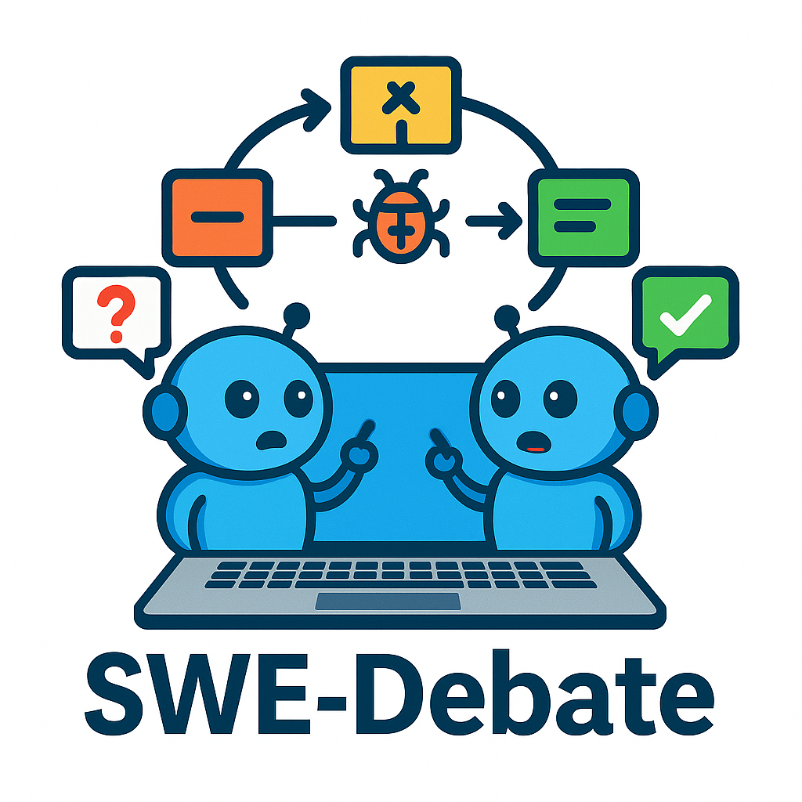
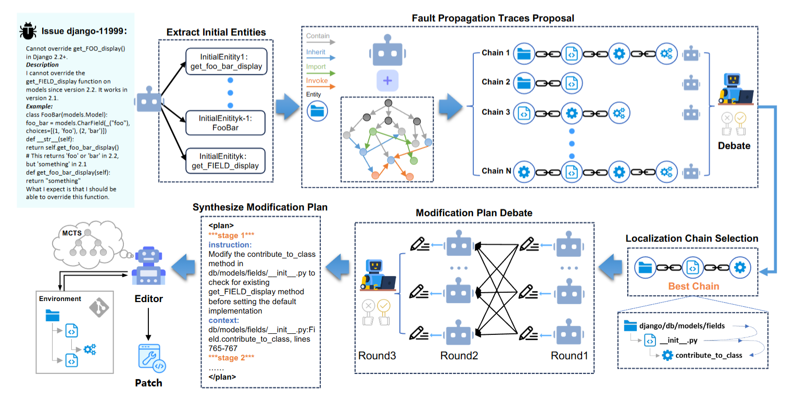

<div align="center">
  
</div>

# SWE-Debate: Competitive Multi-Agent Debate for Software Issue Resolution

[](https://opensource.org/licenses/Apache-2.0)
[](https://www.python.org/downloads/)

SWE-Debate, a competitive multi-agent debate framework that promotes diverse reasoning paths and achieves more consolidated fault localization.SWE-Debate reframes issue resolution through graph-guided local-ization and structured debate mechanisms. 

## 🎯 Method Features

This project integrates an advanced **Entity Localization Pipeline** based on the Moatless framework, achieving the following breakthrough features:

- **🔍 Intelligent Entity Extraction**: Automatically identifies key code entities (classes, methods, functions, variables) from issue descriptions
- **🕸️ Graph-Driven Search**: Performs deep traversal and relevance analysis based on code dependency graphs
- **⛓️ Localization Chain Generation**: Constructs complete code localization chains from problems to solutions
- **🤖 Multi-Agent Collaborative Debate**: Multiple expert agents collaborate in analysis and debate to ensure accuracy and comprehensiveness of solutions
- **📋 Automated Solution Generation**: Generates detailed, highly instructive code modification guidance plans


<div align="center">
  
  <p><i>Figure: Complete workflow of SWE-Debate</i></p>
</div>


```

## 🚀 Quick Start

### Requirements

- Python 3.12+
- OpenAI API key or LLM API supporting OpenAI format

### Installation Steps

1. **Clone the project**
```bash
git clone https://github.com/YerbaPage/SWE-Debate
cd SWE-Debate
```

2. **Install dependencies**
```bash
# Install main dependencies
pip install -r localization/requirements.txt

# Install SWE-Search dependencies
pip install moatless-tree-search
```

3. **Configure environment variables**
```bash
# Create .env file
cp .env.example .env

# Edit .env file, add your API configuration
OPENAI_API_KEY=your_api_key_here
OPENAI_BASE_URL=your_base_url_here  # Optional, for custom API endpoints
```


### Entity Localization Pipeline

```python
from localization.entity_localization_pipeline import EntityLocalizationPipeline

# initialize
pipeline = EntityLocalizationPipeline(
    model_name="deepseek/deepseek-chat",
    max_depth=5
)

# run
result = pipeline.run_pipeline(
    instance_data=instance_data,
    context=file_context,
    max_initial_entities=5
)
```


## 🔗 Related Links

- [Moatless Framework](https://github.com/aorwall/moatless-tree-search)
- [LocAgent](https://github.com/gersteinlab/LocAgent)
- [SWE-bench Benchmark](https://www.swebench.com/)

## 🙏 Acknowledgments

This project draws inspiration from and builds upon the methodologies presented in LocAgent. We acknowledge their contributions to the field of automated code localization.

---

