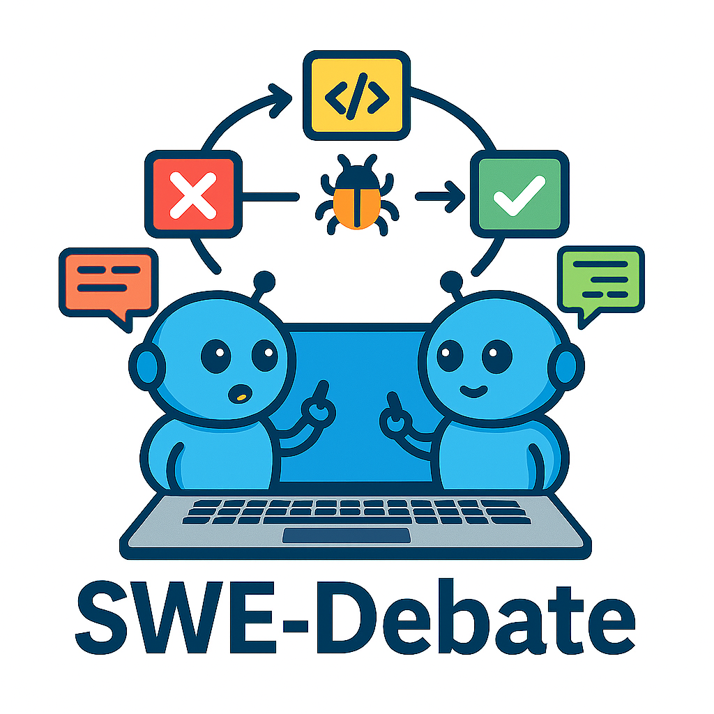

<div align="center">
  
</div>

# SWE-Debate: Competitive Multi-Agent Debate for Software Issue Resolution

[](https://opensource.org/licenses/Apache-2.0)
[](https://www.python.org/downloads/)

SWE-Debate, a competitive multi-agent debate framework that promotes diverse reasoning paths and achieves more consolidated fault localization.SWE-Debate reframes issue resolution through graph-guided local-ization and structured debate mechanisms. 

## 🎯 Method Features

This project integrates an advanced **Entity Localization Pipeline** based on the Moatless framework, achieving the following breakthrough features:

- **🔍 Intelligent Entity Extraction**: Automatically identifies key code entities (classes, methods, functions, variables) from issue descriptions
- **🕸️ Graph-Driven Search**: Performs deep traversal and relevance analysis based on code dependency graphs
- **⛓️ Localization Chain Generation**: Constructs complete code localization chains from problems to solutions
- **🤖 Multi-Agent Collaborative Debate**: Multiple expert agents collaborate in analysis and debate to ensure accuracy and comprehensiveness of solutions
- **📋 Automated Solution Generation**: Generates detailed, highly instructive code modification guidance plans


<div align="center">
  
  <p><i>Figure: Complete workflow of SWE-Debate</i></p>
</div>


```

## 🚀 Quick Start

### Requirements

- Python 3.12+
- OpenAI API key or LLM API supporting OpenAI format

### Installation Steps

1. **Clone the project**
```bash
git clone https://github.com/YerbaPage/SWE-Debate
cd SWE-Debate
```

2. **Install dependencies**
```bash
# Install main dependencies
pip install -r localization/requirements.txt

# Install SWE-Search dependencies
pip install moatless-tree-search
```

3. **Configure environment variables**
```bash
# Create .env file
cp .env.example .env

# Edit .env file, add your API configuration
OPENAI_API_KEY=your_api_key_here
OPENAI_BASE_URL=your_base_url_here  # Optional, for custom API endpoints
```


### Entity Localization Pipeline

```python
from localization.entity_localization_pipeline import EntityLocalizationPipeline

# initialize
pipeline = EntityLocalizationPipeline(
    model_name="deepseek/deepseek-chat",
    max_depth=5
)

# run
result = pipeline.run_pipeline(
    instance_data=instance_data,
    context=file_context,
    max_initial_entities=5
)
```

### Example:  Entity Localization Pipeline + MCTS Flow
```python
react_completion_model = ReActCompletionModel(model="deepseek/deepseek-chat", temperature=0.7)
completion_model = CompletionModel(model="deepseek/deepseek-chat", temperature=0.7)
discriminator_model = CompletionModel(model="deepseek/deepseek-chat", temperature=1)
value_model = CompletionModel(model="deepseek/deepseek-chat", temperature=0.2)

react_completion_model.response_format = LLMResponseFormat.REACT
completion_model.response_format = LLMResponseFormat.REACT
discriminator_model.response_format = LLMResponseFormat.REACT
value_model.response_format = LLMResponseFormat.REACT

instance = get_moatless_instance(instance_id=instance_id) 
repository = create_repository(instance)
index_store_dir = os.getenv("INDEX_STORE_DIR", os.path.abspath("tmp/index_store"))

code_index = CodeIndex.from_index_name(
    instance["instance_id"], file_repo=repository, index_store_dir=index_store_dir
)

file_context = FileContext(repo=repository)

current_date = datetime.now().strftime("%Y-%m-%d")
instance_path = f'{base_dir}/trajectory/{instance_id}/'
persist_path = f'{base_dir}/trajectory/{instance_id}/{current_date}_trajectory.json'

value_function = ValueFunction(completion_model=value_model)
actions = [
    FindClass(completion_model=react_completion_model, code_index=code_index, repository=repository),
    FindFunction(completion_model=react_completion_model, code_index=code_index, repository=repository),
    FindCodeSnippet(completion_model=react_completion_model, code_index=code_index, repository=repository),
    SemanticSearch(completion_model=react_completion_model, code_index=code_index, repository=repository),
    ViewCode(completion_model=react_completion_model, repository=repository),
    StringReplace(repository=repository, code_index=code_index),
    CreateFile(repository=repository, code_index=code_index),
    Finish(),
]

system_prompt = AGENT_ROLE
if completion_model.response_format == LLMResponseFormat.REACT:
    system_prompt += REACT_CORE_OPERATION_RULES
elif completion_model.response_format == LLMResponseFormat.TOOLS:
    system_prompt += REACT_GUIDELINES
workflow_prompt = generate_workflow_prompt(actions, has_runtime=True)
system_prompt += workflow_prompt + generate_guideline_prompt(has_runtime=True) + ADDITIONAL_NOTES

agent = CodingAgent(system_prompt=system_prompt, actions=actions, completion=react_completion_model)

discriminator = AgentDiscriminator(
    completion=discriminator_model,
    n_agents=5,
    n_rounds=3,
)

feedback_generator = FeedbackAgent(
    completion_model=completion_model, instance_dir=instance_path
)

from entity_localization_pipeline import EntityLocalizationPipeline
pipeline = EntityLocalizationPipeline()
results = pipeline.run_pipeline(
    instance,"context",
    max_initial_entities=5
)

search_tree = SearchTree.create(
    message=f'{results}',
    agent=agent,
    file_context=file_context,
    value_function=value_function,
    discriminator=discriminator,
    feedback_generator=feedback_generator,
    max_finished_nodes=max_finish_nodes,
    max_iterations=max_iterations,
    max_expansions=3,
    max_depth=20,
    max_duplicate_count=5, 
    persist_path=persist_path,
)
finished_node = search_tree.run_search()
search_tree.persist(persist_path)

```

## 🔗 Related Links

- [Moatless Framework](https://github.com/aorwall/moatless-tree-search)
- [LocAgent](https://github.com/gersteinlab/LocAgent)
- [SWE-bench Benchmark](https://www.swebench.com/)

## 🙏 Acknowledgments

This project draws inspiration from and builds upon the methodologies presented in LocAgent. We acknowledge their contributions to the field of automated code localization.

---

